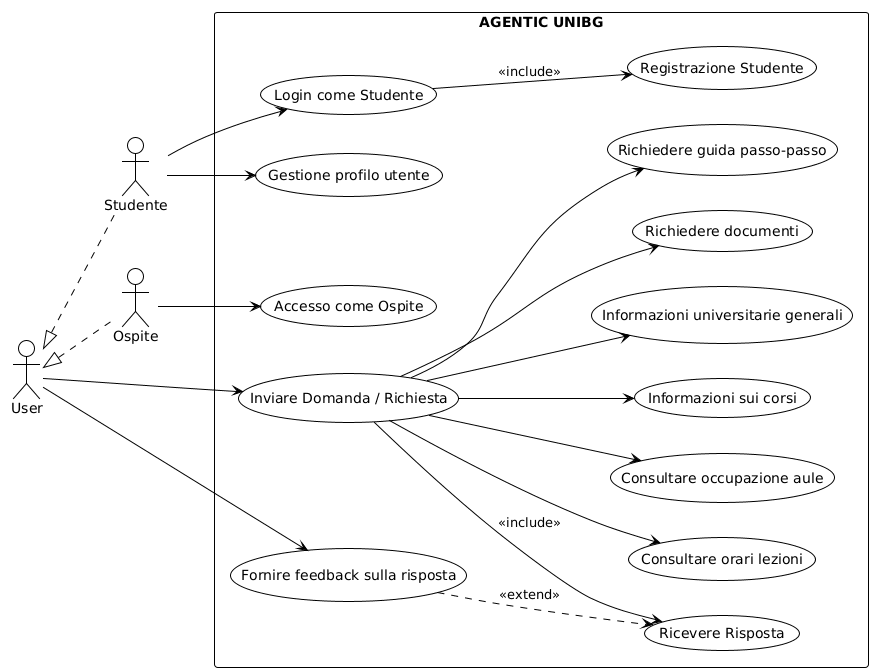

# Requisiti Funzionali - Agentic UniBG

## Template Use Case

Ogni use case è descritto secondo il seguente template:

- **ID**: Identificatore univoco
- **Nome**: Nome del caso d'uso
- **Descrizione**: Breve descrizione della funzionalità
- **Attori**: Chi interagisce con il sistema
- **Precondizioni**: Condizioni necessarie prima dell'esecuzione
- **Flusso Principale**: Sequenza di passi per il caso d'uso
- **Flussi Alternativi**: Variazioni del flusso principale
- **Postcondizioni**: Stato del sistema dopo l'esecuzione
- **Priorità**: Alta/Media/Bassa

---

## Diagramma Use Case

*Figura 1: Diagramma UML dei casi d'uso del sistema Agentic UniBG*

---

## UC-01: Login come Studente

- **ID**: UC-01
- **Nome**: Login come Studente
- **Descrizione**: Permette agli studenti registrati di autenticarsi al sistema per accedere alle funzionalità personalizzate
- **Attori**: Studente
- **Precondizioni**: L'utente deve essere registrato nel sistema
- **Flusso Principale**:
  1. Lo studente seleziona l'opzione "Login come Studente"
  2. Il sistema richiede le credenziali (username/email e password)
  3. Lo studente inserisce le credenziali
  4. Il sistema verifica le credenziali
  5. Il sistema autentica lo studente e mostra la pagina principale personalizzata
- **Flussi Alternativi**:
  - 4a. Credenziali non valide: il sistema mostra un messaggio di errore e richiede nuovamente le credenziali
  - 4b. Account non attivo: il sistema notifica che l'account deve essere attivato
- **Postcondizioni**: Lo studente è autenticato e ha accesso alle funzionalità personalizzate
- **Priorità**: Alta

---

## UC-02: Registrazione Studente

- **ID**: UC-02
- **Nome**: Registrazione Studente
- **Descrizione**: Permette a un nuovo studente di creare un account nel sistema
- **Attori**: Studente (non registrato)
- **Precondizioni**: L'utente non è ancora registrato nel sistema
- **Flusso Principale**:
  1. Lo studente seleziona l'opzione "Registrazione"
  2. Il sistema richiede i dati necessari (nome, cognome, email universitaria, password, matricola)
  3. Lo studente inserisce i dati richiesti
  4. Il sistema valida i dati inseriti
  5. Il sistema crea l'account e invia email di conferma
  6. Lo studente conferma l'email
  7. Il sistema attiva l'account
- **Flussi Alternativi**:
  - 4a. Dati non validi: il sistema mostra gli errori e richiede correzioni
  - 4b. Email già registrata: il sistema notifica che l'account esiste già
- **Postcondizioni**: Lo studente ha un account attivo e può effettuare il login
- **Priorità**: Alta
- **Note**: Include nel processo di Login come Studente (UC-01)

---

## UC-03: Gestione Profilo Utente

- **ID**: UC-03
- **Nome**: Gestione Profilo Utente
- **Descrizione**: Permette allo studente autenticato di visualizzare e modificare i propri dati personali
- **Attori**: Studente
- **Precondizioni**: Lo studente deve essere autenticato nel sistema
- **Flusso Principale**:
  1. Lo studente accede alla sezione "Profilo"
  2. Il sistema mostra i dati correnti dell'utente
  3. Lo studente modifica i dati desiderati
  4. Lo studente conferma le modifiche
  5. Il sistema valida e salva i nuovi dati
  6. Il sistema conferma l'aggiornamento
- **Flussi Alternativi**:
  - 5a. Dati non validi: il sistema mostra gli errori e richiede correzioni
  - 3a. Visualizzazione senza modifiche: lo studente visualizza solo i dati
- **Postcondizioni**: I dati del profilo sono aggiornati nel sistema
- **Priorità**: Media

---

## UC-04: Accesso come Ospite

- **ID**: UC-04
- **Nome**: Accesso come Ospite
- **Descrizione**: Permette a utenti non registrati di accedere a funzionalità limitate del sistema
- **Attori**: Ospite (utente non registrato)
- **Precondizioni**: Nessuna
- **Flusso Principale**:
  1. L'ospite seleziona l'opzione "Accesso come Ospite"
  2. Il sistema concede l'accesso con funzionalità limitate
  3. L'ospite può utilizzare le funzionalità base di interrogazione
- **Flussi Alternativi**: Nessuno
- **Postcondizioni**: L'ospite ha accesso limitato alle funzionalità del sistema
- **Priorità**: Media

---

## UC-05: Inviare Domanda/Richiesta

- **ID**: UC-05
- **Nome**: Inviare Domanda/Richiesta
- **Descrizione**: Permette a qualsiasi utente (studente o ospite) di inviare domande o richieste al sistema
- **Attori**: Studente, Ospite, User
- **Precondizioni**: L'utente ha accesso al sistema (come studente autenticato o ospite)
- **Flusso Principale**:
  1. L'utente inserisce una domanda o richiesta nella chat
  2. Il sistema riceve e analizza la richiesta
  3. Il sistema identifica il tipo di richiesta
  4. Il sistema elabora la richiesta utilizzando gli agenti appropriati
  5. Il sistema fornisce la risposta all'utente (UC-12)
- **Flussi Alternativi**:
  - 3a. Richiesta non chiara: il sistema chiede chiarimenti all'utente
  - 4a. Informazioni non disponibili: il sistema notifica l'impossibilità di rispondere
- **Postcondizioni**: L'utente riceve una risposta alla propria richiesta
- **Priorità**: Alta
- **Note**: Questo è lo use case principale che include vari sotto-casi specializzati (UC-06 a UC-11)

---

## UC-06: Richiedere Guida Passo-Passo

- **ID**: UC-06
- **Nome**: Richiedere Guida Passo-Passo
- **Descrizione**: L'utente richiede una guida dettagliata su come completare una procedura universitaria
- **Attori**: Studente, Ospite, User
- **Precondizioni**: L'utente ha accesso al sistema
- **Flusso Principale**:
  1. L'utente richiede una guida passo-passo per una procedura specifica
  2. Il sistema identifica la procedura richiesta
  3. Il sistema recupera la guida dalla knowledge base
  4. Il sistema presenta la guida in formato sequenziale e comprensibile
  5. Il sistema verifica se l'utente ha bisogno di ulteriori chiarimenti
- **Flussi Alternativi**:
  - 2a. Procedura non riconosciuta: il sistema chiede ulteriori dettagli
  - 3a. Guida non disponibile: il sistema suggerisce alternative o contatti
- **Postcondizioni**: L'utente ha ricevuto una guida dettagliata per la procedura richiesta
- **Priorità**: Alta

---

## UC-07: Richiedere Documenti

- **ID**: UC-07
- **Nome**: Richiedere Documenti
- **Descrizione**: L'utente richiede informazioni su come ottenere o scaricare documenti universitari
- **Attori**: Studente, Ospite, User
- **Precondizioni**: L'utente ha accesso al sistema
- **Flusso Principale**:
  1. L'utente richiede informazioni su un documento specifico
  2. Il sistema identifica il tipo di documento
  3. Il sistema fornisce informazioni su come ottenere il documento
  4. Il sistema fornisce link o riferimenti per il download/richiesta
- **Flussi Alternativi**:
  - 2a. Documento richiede autenticazione: il sistema verifica lo stato dell'utente
  - 3a. Documento non disponibile online: il sistema fornisce istruzioni per richiederlo agli uffici
- **Postcondizioni**: L'utente ha ricevuto le informazioni necessarie per ottenere il documento
- **Priorità**: Alta

---

## UC-08: Informazioni Universitarie Generali

- **ID**: UC-08
- **Nome**: Informazioni Universitarie Generali
- **Descrizione**: L'utente richiede informazioni generali sull'università (servizi, strutture, contatti, etc.)
- **Attori**: Studente, Ospite, User
- **Precondizioni**: L'utente ha accesso al sistema
- **Flusso Principale**:
  1. L'utente pone una domanda generale sull'università
  2. Il sistema analizza la domanda
  3. Il sistema recupera le informazioni
  4. Il sistema fornisce la risposta in modo chiaro e strutturato
- **Flussi Alternativi**:
  - 3a. Informazione non disponibile: il sistema fornisce contatti degli uffici competenti
  - 2a. Domanda ambigua: il sistema chiede chiarimenti
- **Postcondizioni**: L'utente ha ricevuto le informazioni generali richieste
- **Priorità**: Media

---

## UC-09: Informazioni sui Corsi

- **ID**: UC-09
- **Nome**: Informazioni sui Corsi
- **Descrizione**: L'utente richiede informazioni specifiche su corsi, programmi, docenti, esami
- **Attori**: Studente, Ospite, User
- **Precondizioni**: L'utente ha accesso al sistema
- **Flusso Principale**:
  1. L'utente richiede informazioni su un corso specifico
  2. Il sistema identifica il corso
  3. Il sistema recupera le informazioni dal database dei corsi
  4. Il sistema presenta informazioni (programma, docente, CFU, modalità esame, etc.)
- **Flussi Alternativi**:
  - 2a. Corso non trovato: il sistema suggerisce corsi simili o chiede più dettagli
  - 3a. Informazioni parziali: il sistema fornisce ciò che è disponibile e indica lacune
- **Postcondizioni**: L'utente ha ricevuto informazioni dettagliate sul corso richiesto
- **Priorità**: Alta

---

## UC-10: Consultare Occupazione Aule

- **ID**: UC-10
- **Nome**: Consultare Occupazione Aule
- **Descrizione**: L'utente verifica la disponibilità o l'occupazione di aule specifiche
- **Attori**: Studente, Ospite, User
- **Precondizioni**: L'utente ha accesso al sistema
- **Flusso Principale**:
  1. L'utente richiede informazioni sull'occupazione di un'aula
  2. Il sistema identifica l'aula e il periodo temporale
  3. Il sistema consulta il database degli orari
  4. Il sistema mostra lo stato di occupazione dell'aula
- **Flussi Alternativi**:
  - 2a. Aula non specificata: il sistema chiede quale aula
  - 2b. Periodo non specificato: il sistema assume il momento corrente
  - 3a. Informazioni non disponibili: il sistema notifica l'impossibilità
- **Postcondizioni**: L'utente conosce lo stato di occupazione dell'aula richiesta
- **Priorità**: Media

---

## UC-11: Consultare Orari Lezioni

- **ID**: UC-11
- **Nome**: Consultare Orari Lezioni
- **Descrizione**: L'utente consulta gli orari delle lezioni per corsi specifici o per il proprio piano di studi
- **Attori**: Studente, Ospite, User
- **Precondizioni**: L'utente ha accesso al sistema
- **Flusso Principale**:
  1. L'utente richiede gli orari delle lezioni
  2. Il sistema identifica se si tratta di un corso specifico o del piano studente
  3. Il sistema recupera gli orari dal database
  4. Il sistema presenta gli orari in formato leggibile
  5. Il sistema fornisce la risposta completa (UC-12)
- **Flussi Alternativi**:
  - 2a. Studente autenticato: il sistema può recuperare il piano studi personalizzato
  - 3a. Orari non disponibili: il sistema notifica e suggerisce alternative
- **Postcondizioni**: L'utente ha visualizzato gli orari delle lezioni richieste
- **Priorità**: Alta
- **Note**: Include il sotto-caso UC-12 (Ricevere Risposta)

---

## UC-12: Ricevere Risposta

- **ID**: UC-12
- **Nome**: Ricevere Risposta
- **Descrizione**: Il sistema fornisce la risposta elaborata all'utente
- **Attori**: Studente, Ospite, User
- **Precondizioni**: L'utente ha inviato una domanda/richiesta
- **Flusso Principale**:
  1. Il sistema completa l'elaborazione della richiesta
  2. Il sistema formatta la risposta in modo chiaro
  3. Il sistema presenta la risposta all'utente nella chat
  4. Il sistema chiede se l'utente necessita di ulteriori chiarimenti
- **Flussi Alternativi**:
  - 1a. Errore nell'elaborazione: il sistema notifica l'errore e si scusa
  - 4a. L'utente richiede chiarimenti: ritorno a UC-05
- **Postcondizioni**: L'utente ha ricevuto una risposta alla propria richiesta
- **Priorità**: Alta
- **Note**: Questo use case è incluso in UC-11 e può estendersi in UC-13

---

## UC-13: Fornire Feedback sulla Risposta

- **ID**: UC-13
- **Nome**: Fornire Feedback sulla Risposta
- **Descrizione**: L'utente può fornire un feedback sulla qualità e utilità della risposta ricevuta
- **Attori**: Studente, Ospite, User
- **Precondizioni**: L'utente ha ricevuto una risposta dal sistema (UC-12)
- **Flusso Principale**:
  1. Il sistema propone all'utente di valutare la risposta
  2. L'utente fornisce un feedback (positivo/negativo, valutazione, commento)
  3. Il sistema registra il feedback
  4. Il sistema ringrazia l'utente
  5. Il sistema utilizza il feedback per migliorare future risposte
- **Flussi Alternativi**:
  - 2a. L'utente non fornisce feedback: il sistema continua normalmente
  - 2b. Feedback negativo: il sistema chiede dettagli su cosa non ha funzionato (può inviare una nuova risposta)
- **Postcondizioni**: Il feedback è registrato nel sistema per analisi e miglioramento
- **Priorità**: Media
- **Note**: Questo use case estende UC-12 (Ricevere Risposta)

---

## Riepilogo Priorità

### Alta Priorità
- UC-01: Login come Studente
- UC-02: Registrazione Studente
- UC-05: Inviare Domanda/Richiesta
- UC-06: Richiedere Guida Passo-Passo
- UC-07: Richiedere Documenti
- UC-09: Informazioni sui Corsi
- UC-11: Consultare Orari Lezioni
- UC-12: Ricevere Risposta

### Media Priorità
- UC-03: Gestione Profilo Utente
- UC-04: Accesso come Ospite
- UC-08: Informazioni Universitarie Generali
- UC-10: Consultare Occupazione Aule
- UC-13: Fornire Feedback sulla Risposta

---

## Note Generali

- Il sistema deve supportare sia utenti autenticati (studenti) che ospiti
- Gli use case UC-06 a UC-11 sono specializzazioni di UC-05
- UC-12 è incluso in UC-11 e rappresenta la fase finale di risposta
- UC-13 estende UC-12 per raccogliere feedback
- Tutte le interazioni avvengono tramite interfaccia conversazionale (chat)
